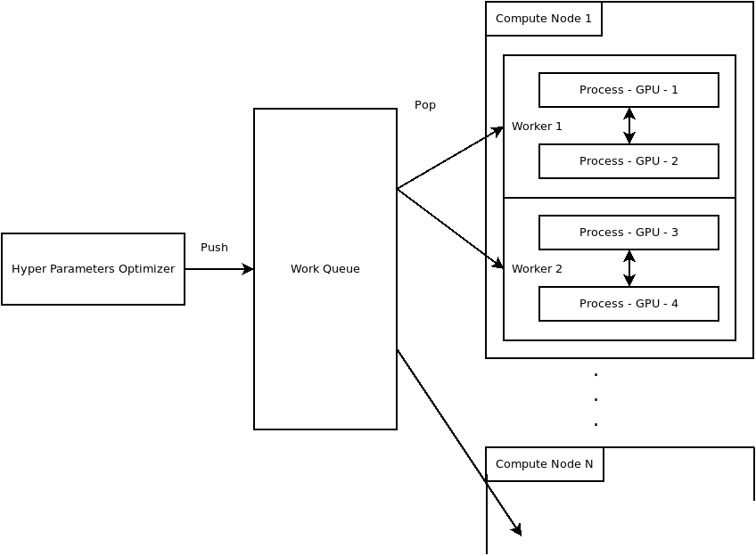
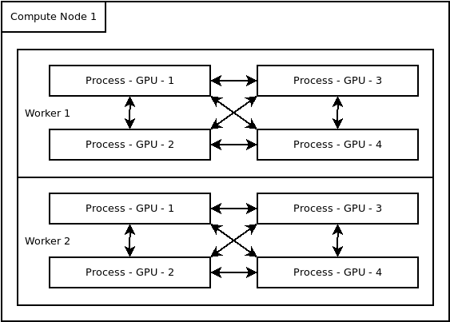

Launcher
========

Olympus launcher is used as the common entry point for all Olympus baselines.
While each baselines have their own entry point that can be used independently,
The launcher has a few features of its own that can help user running the baselines
as efficiently as possible.

The biggest features that the launcher brings is parallelization and monitoring.

Parallelization
~~~~~~~~~~~~~~~

* ``--devices 0,1,2,3``: List of devices that are available to olympus
    If not provided it will query pytorch and use all available GPUs
* ``--device-sharing``: Enable GPUs to be shared between workers.
    By default devices a split between workers. In some cases it might be interesting
    to run multiple workers on the same set of GPUs to increase efficiency (better utilization)
* ``--workers``: The number of worker you want the launcher to spawn.
    Workers execute independent experiments.

The image below illustrate the following configuration ``--devices 0,1,2,3 --workers 2 --no-device-sharing``.
Where two workers are spawn each using 2 GPUs to train a model using the
distributed data parallel API or pytorch.

The image below illustrate the following configuration ``--devices 0,1,2,3 --workers 2 --device-sharing``.

Monitoring
~~~~~~~~~~

After all setting is done and all workers have been launch, the script starts to monitor GPU usage.
It will display its results at the end. This can be used to make sure you are using the resources well.

* ``--no-mon``: Disable GPU monitoring

You can find below an output example of the monitoring process.

.. code-block:: javascript

    {
      "temperature.gpu": 34.083333333333336,
      "utilization.gpu": 10.333333333333334,
      "utilization.memory": 0.0,
      "memory.total": 32480.0,
      "memory.free": 31672.833333333332,
      "memory.used": 807.1666666666666
    }

.. automodule:: olympus.baselines.launch
    :members:
    :undoc-members:
    :show-inheritance: