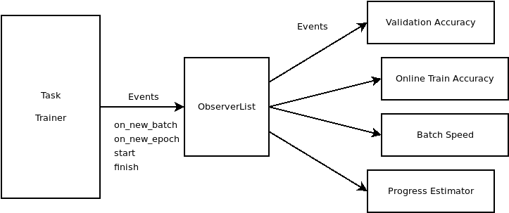

Observers
=========

Olympus use a set of ``Observer`` objects to monitor a training in progress.
This allow Olympus to keep the training code short and focused on its purpose.

For example, all metrics, validation, online accuracy, speed are computed through observer, making
that logic easily reusable for different tasks.

Available Observers
-------------------

More Observers are defined as metrics.

.. toctree::

   progress

Observer Interface
------------------

.. automodule:: olympus.observers.observer
    :members:
    :undoc-members:
    :show-inheritance:

Observer List
-------------

.. automodule:: olympus.observers
    :members:
    :undoc-members:
    :show-inheritance:
